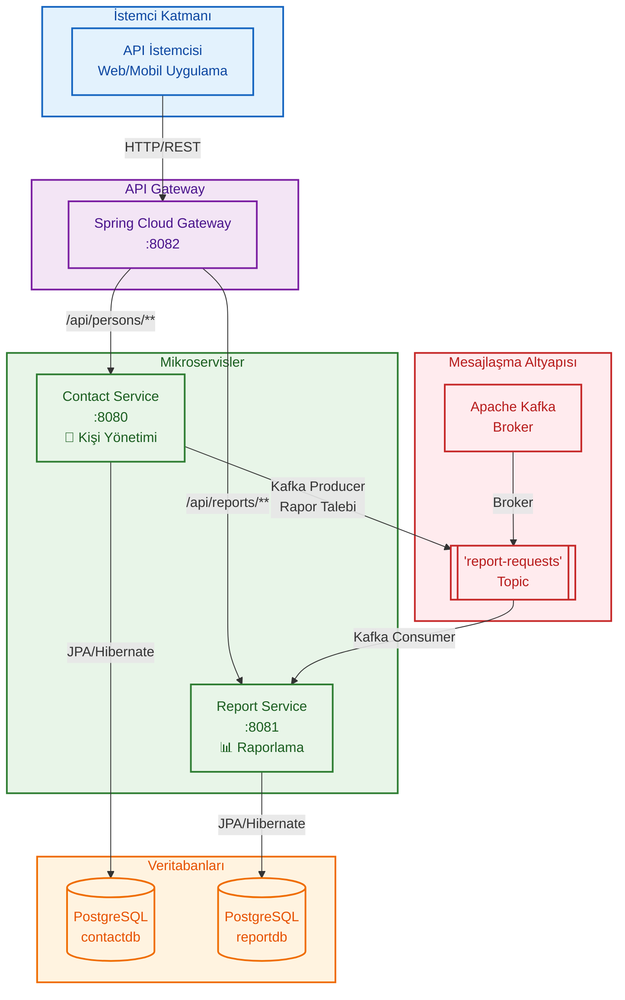
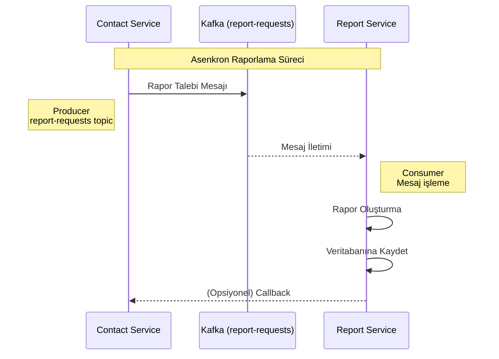
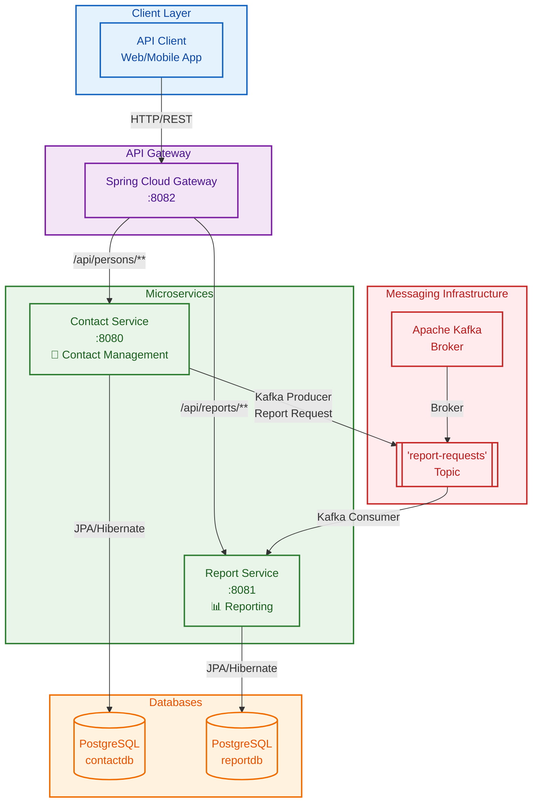

# Phonebook System (Telefon Rehberi Sistemi)

Bu proje, mikroservis mimarisi kullanılarak geliştirilmiş kapsamlı bir Telefon Rehberi ve Raporlama sistemidir.

---

## 📋 İçindekiler
- [Teknolojiler ve Versiyonlar](#teknolojiler-ve-versiyonlar)
- [Mimari Yapı](#mimari-yapı)
- [Servisler](#servisler)
- [API Endpoints](#api-endpoints)
- [JSON Örnekleri](#json-örnekleri)
- [Kafka Mesajlaşma Akışı](#kafka-mesajlaşma-akışı)
- [Veritabanı Şeması](#veritabanı-şeması)
- [Kurulum ve Çalıştırma](#kurulum-ve-çalıştırma)

---

## 🛠️ Teknolojiler ve Versiyonlar

| Teknoloji | Versiyon | Açıklama |
| :--- | :--- | :--- |
| **Java** | 17 | Temel programlama dili |
| **Spring Boot** | 3.5.9 | Uygulama çatısı |
| **PostgreSQL** | 17 | İlişkisel veritabanı |
| **Apache Kafka** | 7.5.0 | Mesajlaşma broker'ı |
| **MapStruct** | 1.5.5 | Nesne eşleme kütüphanesi |
| **Flyway** | - | Veritabanı migration aracı |
| **Spring Cloud OpenFeign** | - | Servisler arası iletişim |

---

## 🏗️ Mimari Yapı



---

## 🏢 Servisler

### 📇 Contact Service (Port: 8080)
**Amaç:** Kişi ve iletişim bilgilerini yönetmek  
**Veritabanı:** `contactdb` (PostgreSQL)  
**Ana Fonksiyonlar:**
- Kişi kaydı oluşturma, güncelleme, silme
- İletişim bilgileri yönetimi
- Konum bazlı istatistik toplama
- Rapor talepleri için veri sağlama

### 📊 Report Service (Port: 8081)
**Amaç:** Rapor taleplerini işlemek ve sonuçları saklamak  
**Veritabanı:** `reportdb` (PostgreSQL)  
**Ana Fonksiyonlar:**
- Rapor talebi kuyruğa alma
- Rapor oluşturma süreçlerini yönetme
- Rapor geçmişini saklama
- Rapor durum takibi

---

## 🔗 API Endpoints

### Contact Service - `/api/persons`

| Method | Endpoint | Açıklama |
| :--- | :--- | :--- |
| `POST` | `/` | Yeni kişi oluşturur |
| `PUT` | `/{id}` | Kişi bilgilerini günceller |
| `DELETE` | `/{id}` | Kişiyi siler |
| `GET` | `/` | Tüm kişileri listeler (sayfalı) |
| `GET` | `/{id}` | Kişi detaylarını getirir |
| `POST` | `/{id}/contacts` | İletişim bilgisi ekler |
| `DELETE` | `/{id}/contacts/{cId}` | İletişim bilgisini siler |
| `GET` | `/location-stats` | Konum istatistiklerini getirir |

### Report Service - `/api/reports`

| Method | Endpoint | Açıklama |
| :--- | :--- | :--- |
| `POST` | `/request` | Yeni rapor talebi oluşturur |
| `GET` | `/list` | Tüm raporları listeler (sayfalı) |
| `GET` | `/{id}` | Rapor detayını getirir |
| `GET` | `/status/{id}` | Rapor durumunu kontrol eder |

---

## 📝 JSON Örnekleri

### Kişi Oluşturma - `POST /api/persons`

```json
{
  "firstName": "Ahmet",
  "lastName": "Yılmaz",
  "company": "ABC Şirketi"
}
```

### İletişim Bilgisi Ekleme - `POST /api/persons/{id}/contacts`

```json
{
  "type": "PHONE",
  "value": "5551234567"
}
```

> **Not:** İletişim tipleri: `PHONE` (Telefon), `EMAIL` (E-posta), `LOCATION` (Konum)

### Rapor Talebi - `POST /api/reports/request`

```json
{
  "reportType": "LOCATION_STATS",
  "parameters": {
    "dateRange": {
      "start": "2024-01-01",
      "end": "2024-12-31"
    }
  }
}
```

---

## ⚡ Kafka Mesajlaşma Akışı



**Akış Açıklaması:**
1. **Contact Service** yeni bir rapor talebi oluşturur
2. Talep `report-requests` Kafka topic'ine gönderilir
3. **Report Service** topic'ten mesajı tüketir
4. Rapor asenkron olarak oluşturulur ve veritabanına kaydedilir
5. Rapor durumu veritabanında güncellenir

---

## 🗃️ Veritabanı Şeması

### Contact Database (`contactdb`)

#### Tablo: `t_person`
| Sütun | Tip | Açıklama |
| :--- | :--- | :--- |
| `id` | UUID (PK) | Benzersiz kimlik |
| `first_name` | VARCHAR(50) | Ad |
| `last_name` | VARCHAR(50) | Soyad |
| `company` | VARCHAR(100) | Şirket |
| `created_at` | TIMESTAMP | Oluşturulma tarihi |
| `updated_at` | TIMESTAMP | Güncellenme tarihi |

#### Tablo: `t_contact_info`
| Sütun | Tip | Açıklama |
| :--- | :--- | :--- |
| `id` | UUID (PK) | Benzersiz kimlik |
| `person_id` | UUID (FK) | Kişi referansı |
| `type` | VARCHAR(20) | İletişim tipi |
| `value` | VARCHAR(100) | İletişim değeri |
| `created_at` | TIMESTAMP | Oluşturulma tarihi |

### Report Database (`reportdb`)

#### Tablo: `t_report`
| Sütun | Tip | Açıklama |
| :--- | :--- | :--- |
| `id` | UUID (PK) | Benzersiz kimlik |
| `request_date` | TIMESTAMP | Talep tarihi |
| `completion_date` | TIMESTAMP | Tamamlanma tarihi |
| `status` | VARCHAR(20) | Durum (PENDING, PROCESSING, COMPLETED, FAILED) |
| `report_type` | VARCHAR(50) | Rapor tipi |
| `requested_by` | VARCHAR(100) | Talep eden |

#### Tablo: `t_report_detail`
| Sütun | Tip | Açıklama |
| :--- | :--- | :--- |
| `id` | UUID (PK) | Benzersiz kimlik |
| `report_id` | UUID (FK) | Rapor referansı |
| `location` | VARCHAR(100) | Konum |
| `person_count` | INTEGER | Kişi sayısı |
| `phone_number_count` | INTEGER | Telefon numarası sayısı |
| `created_at` | TIMESTAMP | Oluşturulma tarihi |

---

## ⚙️ Kurulum ve Çalıştırma

### Ön Gereksinimler
- Docker ve Docker Compose
- Java 17
- Maven 3.6+

### Adım Adım Kurulum

#### 1. Altyapıyı Başlatma
```bash
# Docker konteynerlarını başlat
docker-compose up -d

# Servislerin durumunu kontrol et
docker-compose ps
```

#### 2. Servisleri Derleme ve Çalıştırma
```bash
# Contact Service'i başlat
cd contact-service
mvn clean spring-boot:run

# Report Service'i başlat (yeni terminalde)
cd report-service
mvn clean spring-boot:run
```

#### 3. Servis Sağlık Kontrolleri
```bash
# Contact Service sağlık kontrolü
curl http://localhost:8080/actuator/health

# Report Service sağlık kontrolü
curl http://localhost:8081/actuator/health

# Veritabanı bağlantı kontrolü
curl http://localhost:8080/actuator/health/db
```

### Test Senaryoları

#### Senaryo 1: Kişi Yönetimi
```bash
# Yeni kişi oluştur
curl -X POST http://localhost:8080/api/persons \
  -H "Content-Type: application/json" \
  -d '{"firstName": "Mehmet", "lastName": "Demir", "company": "XYZ Ltd."}'

# Kişi listesini getir
curl http://localhost:8080/api/persons
```

#### Senaryo 2: Raporlama Süreci
```bash
# Rapor talebi oluştur
curl -X POST http://localhost:8081/api/reports/request \
  -H "Content-Type: application/json" \
  -d '{"reportType": "LOCATION_STATS"}'

# Rapor durumunu kontrol et
curl http://localhost:8081/api/reports/list
```

---

## 🔧 Sorun Giderme

### Sık Karşılaşılan Sorunlar

#### 1. Veritabanı Bağlantı Hatası
```
Problem: "Connection refused" veya "Database not available"
Çözüm:
1. Docker konteynerlarını yeniden başlat: docker-compose restart
2. Veritabanı portlarını kontrol et: netstat -an | grep 5432
```

#### 2. Kafka Bağlantı Hatası
```
Problem: "Kafka broker not available"
Çözüm:
1. Kafka konteyner durumunu kontrol et: docker-compose logs kafka
2. Topic oluşturmayı dene: docker exec -it kafka kafka-topics --create --topic report-requests --bootstrap-server localhost:9092
```

#### 3. Servis Port Çakışmaları
```
Problem: "Address already in use"
Çözüm:
1. Port kullanımını kontrol et: lsof -i :8080
2. Alternatif port kullan veya mevcut servisi durdur
```

---

## 📞 İletişim ve Destek

Proje ile ilgili sorularınız veya katkıda bulunmak için:

- **Sorun Bildirimi:** GitHub Issues kullanın
- **Geliştirici:** [İsim Soyisim]
- **Versiyon:** 1.0.0
- **Lisans:** MIT License

---

# Phonebook System (English Version)

This project is a comprehensive Phonebook and Reporting system developed using microservices architecture.

---

## 📋 Table of Contents
- [Technologies & Versions](#technologies--versions)
- [Architecture](#architecture)
- [Services](#services)
- [API Endpoints](#api-endpoints)
- [JSON Examples](#json-examples)
- [Kafka Messaging Flow](#kafka-messaging-flow)
- [Database Schema](#database-schema)
- [Setup & Run](#setup--run)

---

## 🛠️ Technologies & Versions

| Technology | Version | Description |
| :--- | :--- | :--- |
| **Java** | 17 | Core programming language |
| **Spring Boot** | 3.5.9 | Application framework |
| **PostgreSQL** | 17 | Relational database |
| **Apache Kafka** | 7.5.0 | Messaging broker |
| **MapStruct** | 1.5.5 | Object mapping library |
| **Flyway** | - | Database migration tool |
| **Spring Cloud OpenFeign** | - | Service-to-service communication |

---

## 🏗️ Architecture



---

## 🏢 Services

### 📇 Contact Service (Port: 8080)
**Purpose:** Manage person and contact information  
**Database:** `contactdb` (PostgreSQL)  
**Main Functions:**
- Create, update, delete person records
- Contact information management
- Collect location-based statistics
- Provide data for report requests

### 📊 Report Service (Port: 8081)
**Purpose:** Process report requests and store results  
**Database:** `reportdb` (PostgreSQL)  
**Main Functions:**
- Queue report requests
- Manage report generation processes
- Store report history
- Track report status

---

## 🔗 API Endpoints

### Contact Service - `/api/persons`

| Method | Endpoint | Description |
| :--- | :--- | :--- |
| `POST` | `/` | Create new person |
| `PUT` | `/{id}` | Update person details |
| `DELETE` | `/{id}` | Delete person |
| `GET` | `/` | List all persons (paginated) |
| `GET` | `/{id}` | Get person details |
| `POST` | `/{id}/contacts` | Add contact info |
| `DELETE` | `/{id}/contacts/{cId}` | Remove contact info |
| `GET` | `/location-stats` | Get location statistics |

### Report Service - `/api/reports`

| Method | Endpoint | Description |
| :--- | :--- | :--- |
| `POST` | `/request` | Create new report request |
| `GET` | `/list` | List all reports (paginated) |
| `GET` | `/{id}` | Get report details |
| `GET` | `/status/{id}` | Check report status |

---

## 📝 JSON Examples

### Create Person - `POST /api/persons`

```json
{
  "firstName": "John",
  "lastName": "Doe",
  "company": "ABC Company"
}
```

### Add Contact Info - `POST /api/persons/{id}/contacts`

```json
{
  "type": "PHONE",
  "value": "5551234567"
}
```

> **Note:** Contact types: `PHONE`, `EMAIL`, `LOCATION`

### Report Request - `POST /api/reports/request`

```json
{
  "reportType": "LOCATION_STATS",
  "parameters": {
    "dateRange": {
      "start": "2024-01-01",
      "end": "2024-12-31"
    }
  }
}
```

---

## ⚡ Kafka Messaging Flow


**Flow Description:**
1. **Contact Service** creates a new report request
2. Request is sent to `report-requests` Kafka topic
3. **Report Service** consumes the message from the topic
4. Report is generated asynchronously and saved to database
5. Report status is updated in the database

---

## 🗃️ Database Schema

### Contact Database (`contactdb`)

#### Table: `t_person`
| Column | Type | Description |
| :--- | :--- | :--- |
| `id` | UUID (PK) | Unique identifier |
| `first_name` | VARCHAR(50) | First name |
| `last_name` | VARCHAR(50) | Last name |
| `company` | VARCHAR(100) | Company |
| `created_at` | TIMESTAMP | Creation timestamp |
| `updated_at` | TIMESTAMP | Update timestamp |

#### Table: `t_contact_info`
| Column | Type | Description |
| :--- | :--- | :--- |
| `id` | UUID (PK) | Unique identifier |
| `person_id` | UUID (FK) | Person reference |
| `type` | VARCHAR(20) | Contact type |
| `value` | VARCHAR(100) | Contact value |
| `created_at` | TIMESTAMP | Creation timestamp |

### Report Database (`reportdb`)

#### Table: `t_report`
| Column | Type | Description |
| :--- | :--- | :--- |
| `id` | UUID (PK) | Unique identifier |
| `request_date` | TIMESTAMP | Request timestamp |
| `completion_date` | TIMESTAMP | Completion timestamp |
| `status` | VARCHAR(20) | Status (PENDING, PROCESSING, COMPLETED, FAILED) |
| `report_type` | VARCHAR(50) | Report type |
| `requested_by` | VARCHAR(100) | Requested by |

#### Table: `t_report_detail`
| Column | Type | Description |
| :--- | :--- | :--- |
| `id` | UUID (PK) | Unique identifier |
| `report_id` | UUID (FK) | Report reference |
| `location` | VARCHAR(100) | Location |
| `person_count` | INTEGER | Person count |
| `phone_number_count` | INTEGER | Phone number count |
| `created_at` | TIMESTAMP | Creation timestamp |

---

## ⚙️ Setup & Run

### Prerequisites
- Docker and Docker Compose
- Java 17
- Maven 3.6+

### Step-by-Step Installation

#### 1. Start Infrastructure
```bash
# Start Docker containers
docker-compose up -d

# Check service status
docker-compose ps
```

#### 2. Build and Run Services
```bash
# Start Contact Service
cd contact-service
mvn clean spring-boot:run

# Start Report Service (in new terminal)
cd report-service
mvn clean spring-boot:run
```

#### 3. Service Health Checks
```bash
# Contact Service health check
curl http://localhost:8080/actuator/health

# Report Service health check
curl http://localhost:8081/actuator/health

# Database connection check
curl http://localhost:8080/actuator/health/db
```

### Test Scenarios

#### Scenario 1: Person Management
```bash
# Create new person
curl -X POST http://localhost:8080/api/persons \
  -H "Content-Type: application/json" \
  -d '{"firstName": "John", "lastName": "Smith", "company": "XYZ Ltd."}'

# Get person list
curl http://localhost:8080/api/persons
```

#### Scenario 2: Reporting Process
```bash
# Create report request
curl -X POST http://localhost:8081/api/reports/request \
  -H "Content-Type: application/json" \
  -d '{"reportType": "LOCATION_STATS"}'

# Check report status
curl http://localhost:8081/api/reports/list
```

---

## 🔧 Troubleshooting

### Common Issues

#### 1. Database Connection Error
```
Problem: "Connection refused" or "Database not available"
Solution:
1. Restart Docker containers: docker-compose restart
2. Check database ports: netstat -an | grep 5432
```

#### 2. Kafka Connection Error
```
Problem: "Kafka broker not available"
Solution:
1. Check Kafka container status: docker-compose logs kafka
2. Try creating topic: docker exec -it kafka kafka-topics --create --topic report-requests --bootstrap-server localhost:9092
```

#### 3. Service Port Conflicts
```
Problem: "Address already in use"
Solution:
1. Check port usage: lsof -i :8080
2. Use alternative port or stop existing service
```

---

## 📞 Contact & Support

For questions about the project or to contribute:

- **Issue Reporting:** Use GitHub Issues
- **Developer:** [Yakup ŞENATEŞ]
- **Version:** 1.0.0
- **License:** MIT License
